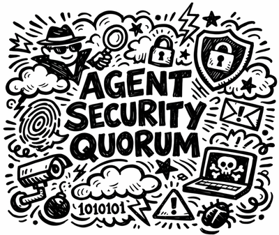

  

# Agent Security Quorum

**Four reviewers. One explicit policy. Evidence on the GitHub Actions run page.**

This teaching project reviews changes to AI agent and skill files. Three models examine the same changed content through security, privilege, and compliance lenses. Cisco Skill Scanner supplies a fourth, static-analysis vote. A separate file-pattern gate can stop the scan without a vote.

**[Start with the Actions walkthrough](docs/demo-walkthrough.md)** or open the [scan history](https://github.com/timothywarner-org/agent-security-quorum/actions/workflows/agent-scan.yml). The run page is the demo interface. No dashboard, hosted application, or local build is required.

## The decision

| Evidence | Decision |
|---|---|
| All four evaluators answer; 0 or 1 UNSAFE votes; file gate passes | **PASS** |
| 2 or more UNSAFE votes | **FAIL** |
| Any missing, invalid, or failed evaluation | **FAIL: incomplete evidence** |
| File gate fails or does not complete | **FAIL: hard stop** |

**One UNSAFE vote can pass.** That is a policy tradeoff, not proof that the dissenter is wrong. Inspect the finding. **SAFE** means that reviewer reported no blocking issue within its scope, not that the change is safe to execute.

An evaluator error is reported as **ERROR**, not as a discovered vulnerability. The result contract retains **error: true** for compatibility; aggregation excludes that result from the valid vote count and fails the scan.

To block merging, your repository must require the **Quorum Decision** status check. Code-owner approval for changes to the scanner and prompts needs its own enforced rule.

## Why different reviewers?

Instructions can look like ordinary Markdown while asking an agent to bypass checks, exceed its permissions, or disclose secrets. Static rules catch known patterns; model reviewers can add contextual findings. Both can miss attacks or generate false alarms.

| Reviewer | Method | Role |
|---|---|---|
| Security | Explicitly selected Copilot model | Injection, exfiltration, trust boundaries |
| Privilege | Explicitly selected Copilot model | Permissions and scope |
| Compliance | Explicitly selected Copilot model | Constraints and governance |
| Static | Cisco Skill Scanner | Pattern and code analysis; high/critical findings vote UNSAFE |
| Test-file gate | File-pattern policy, no model | Hard stop for test/spec/config files inside agent or skill folders |

Models, prompts, and versions are configured in [the workflow](.github/workflows/agent-scan.yml). There is **no default-model fallback**. The summary records the requested model; it does not independently attest the backend model identity. Different model families can share blind spots, and all three model calls depend on GitHub Copilot access. This demonstrates diverse review methods, not independent service failover.

## Follow one run

1. Read the proposed instruction change in the PR.
2. Open its **Agent/Skill Security Scan** run and inspect the named reviewer jobs.
3. Read **Quorum Decision**: vote table, hard stop, error count, policy, and commit reference.
4. Compare findings in the voter summaries. A job that succeeded may still have voted **UNSAFE**: it completed its review successfully.
5. Decide whether the evidence supports the policy decision. Human review still matters.

The [walkthrough](docs/demo-walkthrough.md) supplies recorded examples and a nine-minute route. Historical runs are dated evidence, not claims about today's availability or overall detection accuracy.

## Setup

1. Fork [this repository](https://github.com/timothywarner-org/agent-security-quorum), or copy both workflow files in **.github/workflows/** and the **prompts/** directory into your repository.
2. Create a fine-grained PAT with **Copilot Requests** permission and store it as repository secret **COPILOT_PAT**. Its user's Copilot access must permit the selected models. See [GitHub's authentication instructions](https://docs.github.com/en/copilot/how-tos/copilot-cli/automate-copilot-cli/automate-with-actions).
3. Run **Copilot Access Probe** manually before rehearsal. It checks token expiry and model responses. A weekly schedule checks for drift.
4. Open a PR changing an agent or skill file. Start with a harmless fixture.
5. Review the actual result before making **Quorum Decision** required. See [configuration](docs/configuration-guide.md) for trigger and fork limitations.

Copilot usage draws on the authenticated user's entitlements and may incur charges. Actions usage and human review also count toward operating cost. This project does not measure cost per accepted result.

## Scope and limits

| Location | Scanned content |
|---|---|
| .github/agents/**, .github/skills/** | Agent and skill definitions and bundled files |
| .claude/agents/**, .claude/skills/** | Agent and skill definitions and bundled files |
| .agents/skills/** | Shared skill definitions and bundled files |

Semantic reviewers receive changed text files, capped at **16 KiB per file**; binary and empty files are omitted from the model payload. The static scanner and file-pattern gate inspect the corresponding directories. This is not full-file semantic coverage for large files or a malware sandbox. Structural checks are **advisory**.

PRs changing only workflow files, prompts, or fixtures do not trigger the scanner. Include a harmless agent change when testing the scanner itself. Deletion-only changes have no semantic payload and skip the decision job. Fork PRs normally lack **COPILOT_PAT**; missing credentials cannot produce a valid complete scan.

The PR can also change its own workflow and prompts. **Required code-owner review** is therefore part of the trust boundary. See the [threat model](docs/threat-model.md) before adopting this as a security control.

## Repository map

| Path | Purpose |
|---|---|
| .github/workflows/agent-scan.yml | Scanner, aggregation, run summaries, PR feedback, SARIF |
| .github/workflows/copilot-probe.yml | Token and model availability checks |
| prompts/ | Base rubric and three review lenses |
| test/fixtures/ | Harmless and deliberately risky examples, treated as data |
| docs/demo-walkthrough.md | Run-history presentation route and evidence |
| docs/configuration-guide.md | Setup, policy, troubleshooting |
| docs/org-deployment.md | Small-scale adoption and ownership |
| docs/PRD.md | Historical proposal, not current configuration |

The product stays as inline workflow logic and prompt files. There is no application runtime, package manifest, or scripts framework to deploy.

## Contributing and license

See [CONTRIBUTING.md](CONTRIBUTING.md), [SECURITY.md](SECURITY.md), and the [MIT license](LICENSE).
